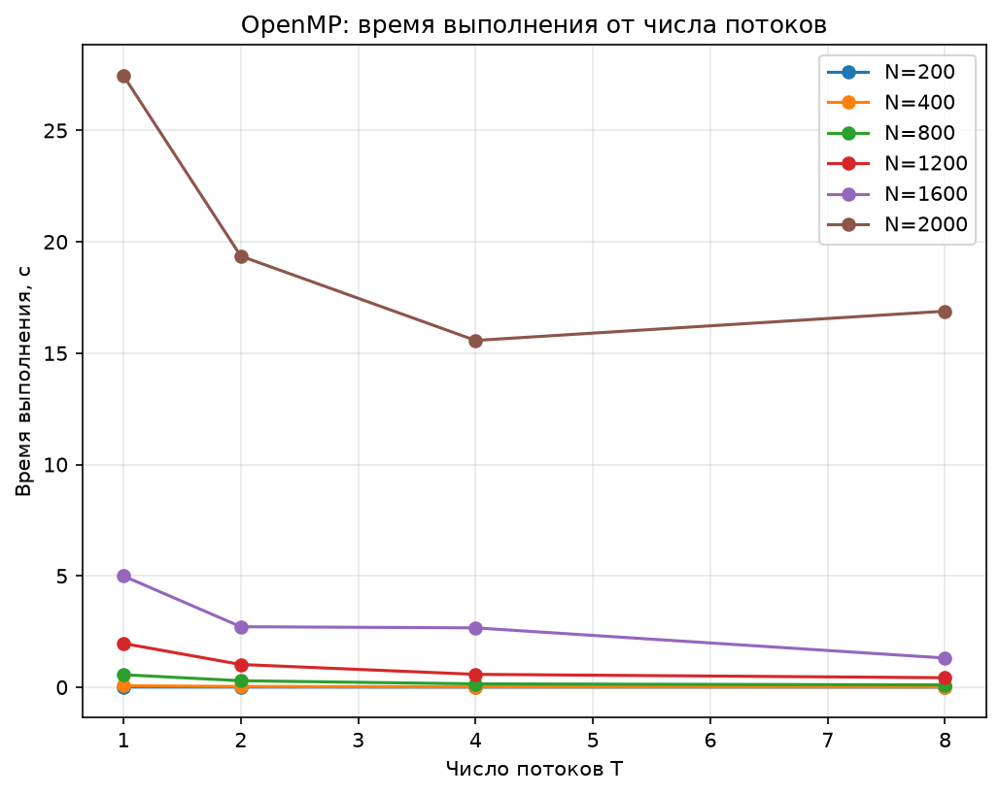
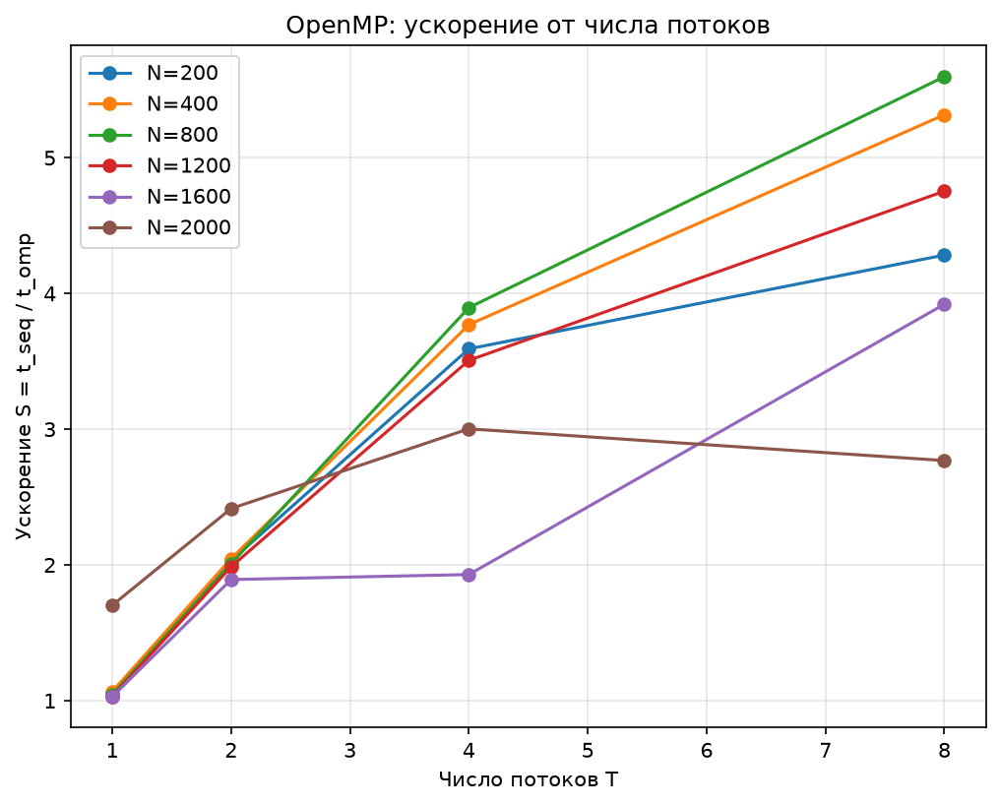
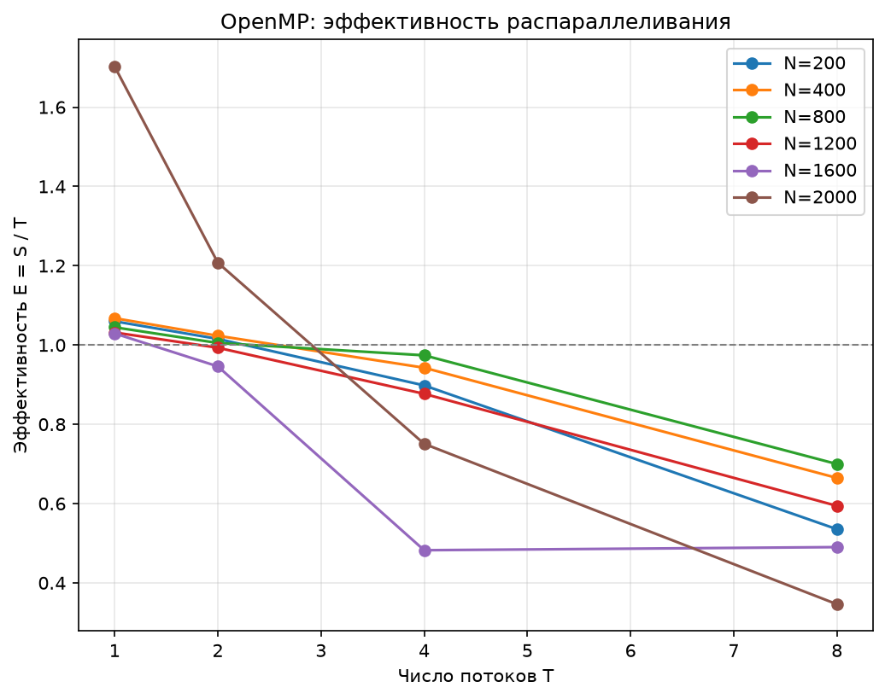
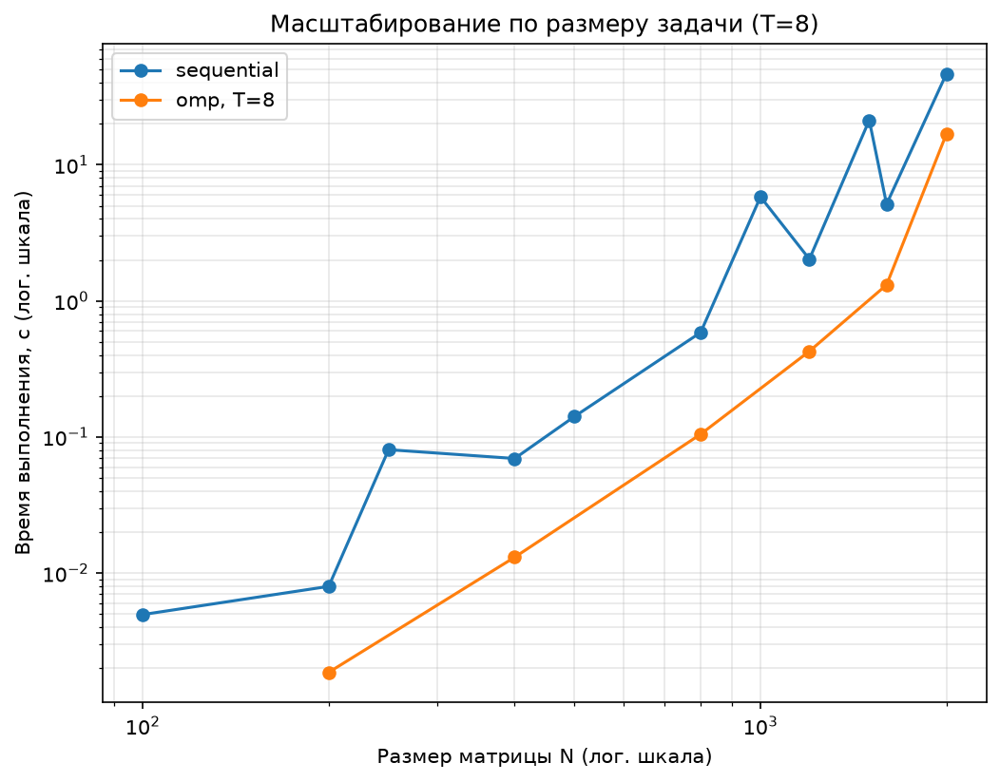

# Лабораторная работа №2
## Параллельное умножение матриц на OpenMP

**Курс:** Параллельное программирование, 2026

---

## 1. Цель работы

Модифицировать программу из лабораторной работы №1 для параллельной работы по технологии OpenMP. Провести серию экспериментов с разным количеством потоков (1, 2, 4, 8) и разными размерами матриц (200, 400, 800, 1200, 1600, 2000), оценить ускорение и эффективность распараллеливания.

### О варьировании числа ядер

Задание допускает вариант, когда нет технической возможности варьировать число используемых физических ядер, и предписывает в этом случае использовать фиксированное существующее их количество. На macOS (в отличие от Linux, где это можно сделать через `taskset`/cgroups) нет штатного способа программно ограничить процесс конкретным подмножеством физических ядер без специальных системных прав. Поэтому в этой работе используется вся доступная вычислительная база устройства — MacBook Air с **8 физическими ядрами** (`sysctl -n hw.physicalcpu` = 8, совпадает с `hw.ncpu` = 8, то есть без Hyper-Threading/SMT), и варьируется только число потоков OpenMP.

## 2. Алгоритм

К последовательной версии и версии на `std::thread` из лабораторной работы 1 добавлена третья стратегия — параллельное умножение на OpenMP. Внешний цикл по строкам результирующей матрицы распределяется директивой `#pragma omp parallel for` между потоками:

```cpp
omp_set_dynamic(0);
omp_set_num_threads(T);
#pragma omp parallel for schedule(static)
for (int i = 0; i < N; ++i) {
    for (int j = 0; j < N; ++j) {
        double sum = 0.0;
        for (int k = 0; k < N; ++k) {
            sum += A[i][k] * B[k][j];
        }
        C[i][j] = sum;
    }
}
```

`omp_set_dynamic(0)` отключает автоматическую корректировку числа потоков системой, `omp_set_num_threads(T)` явно задаёт число потоков для следующей параллельной области, `schedule(static)` делит строки на смежные блоки поровну между потоками — аналогично ручному разбиению в версии на `std::thread` из лабы 1.

Отличие от версии из лабы 1: сумма произведений накапливается в локальной переменной `sum`, а не через прямую индексацию `C[i][j] += ...` на каждой итерации внутреннего цикла. Это не связано с параллелизмом само по себе, но даёт дополнительный выигрыш по скорости уже на одном потоке за счёт меньшего числа обращений к памяти — это заметно на результатах ниже и разобрано отдельно в выводах.

## 3. Среда выполнения

- **Устройство:** MacBook Air (Apple Silicon), 8 физических ядер
- **Компилятор:** Apple Clang, C++17, сборка с `-O3`
- **OpenMP:** через `libomp` (Homebrew), версия 5.1 (Apple Clang не поддерживает OpenMP нативно)
- **Верификация:** `tools/verify.py`, сравнение с NumPy (`numpy.allclose`, rtol=1e-5, atol=1e-3)

Каждая конфигурация (N, T) запускалась однократно (без усреднения по повторам, в отличие от более тщательной методики, где каждый замер повторяется многократно) — это ограничение стоит учитывать при интерпретации отдельных скачков на графиках.

## 4. Результаты

Полная таблица — `data/results.csv`. Графики — `report/lab2/figures/`.



На N=2000 время при T=8 оказывается выше, чем при T=4 (16.9с против 15.6с) — при полной загрузке всех 8 физических ядер вычислением не остаётся запаса под системные процессы, из-за чего суммарное время немного растёт вместо продолжения падения.



Для большинства размеров (400–1200) ускорение растёт почти линейно вплоть до T=4, но на T=8 темп роста замедляется. На N=2000 ускорение на T=1 уже заметно больше 1 (≈1,7) — это эффект другой организации внутреннего цикла (см. п.2), а не параллелизма.



Эффективность E = S/T устойчиво падает с ростом числа потоков — ожидаемое поведение: параллельные накладные расходы (создание потоков, синхронизация) растут быстрее полезной работы на поток. На N=2000 эффективность на T=1 превышает 1 по той же причине, что и выше.



В логарифмических осях обе линии (sequential и omp при T=8) растут с похожим наклоном, что соответствует кубической сложности алгоритма O(N³) в обоих случаях — параллелизм ускоряет вычисление в константное число раз, но не меняет асимптотику.

## 5. Выводы

1. OpenMP-версия работает корректно — все прогоны прошли верификацию через NumPy.
2. Ускорение растёт с числом потоков, но не линейно и не бесконечно: на максимальном размере (N=2000) после T=4 прирост прекращается и даже слегка обращается вспять — на 8-ядерном Mac без SMT восемь потоков полностью занимают все физические ядра, не оставляя запаса под системные процессы.
3. Эффективность распараллеливания закономерно снижается с ростом T — классическое поведение, объясняемое законом Амдала и накладными расходами на управление потоками.
4. Важно не путать алгоритмический выигрыш с выигрышем от параллелизма: замена накопления суммы прямо в ячейке матрицы на локальную переменную дала прирост скорости уже на одном потоке (T=1) — почти в 1,7 раза на N=2000 относительно последовательной версии лабы 1. Это иллюстрирует, что при сравнении параллельных версий важно контролировать не только число потоков, но и то, что сам алгоритм внутри потока не изменился по сравнению с базовым вариантом.
5. Асимптотика (кубический рост времени от N) сохраняется независимо от степени параллелизма — распараллеливание меняет константу, а не порядок роста.
